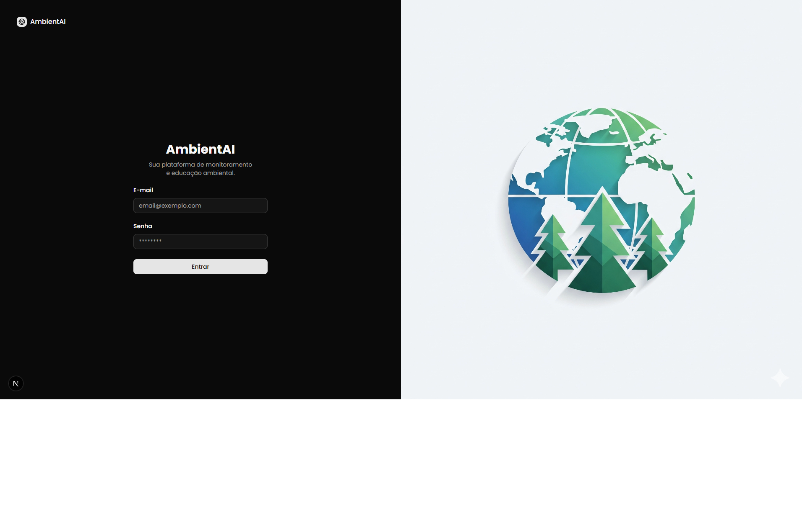
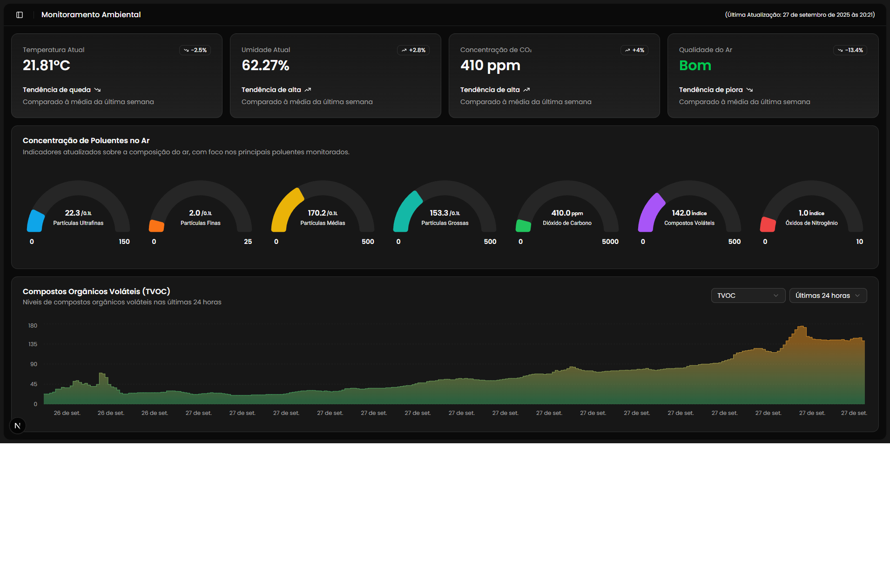

## Projeto de Iniciação Tecnológica: AMBIENTAI

Este repositório contém o código-fonte do frontend da plataforma **AMBIENTAI**.
O sistema foi desenvolvido como parte de uma iniciativa de pesquisa tecnológica da Pró-reitoria de Pesquisa e Pós-Graduação do UniFOA e implementado em parceria com o **CIEP 291 Dom Martinho Schlude**.

### 📌 Descrição do Projeto

O **AMBIENTAI** é uma aplicação web interativa que apresenta dados de qualidade do ar em tempo real, coletados por sensores ambientais integrados à plataforma.
A interface foi desenvolvida para ser **responsiva e acessível**, permitindo que a comunidade escolar e a população local acompanhem indicadores ambientais e compreendam sua importância por meio de uma experiência educativa.

O projeto une **Design, Sistemas de Informação e Educação Ambiental** para sensibilizar a comunidade de Pinheiral-RJ sobre sustentabilidade e mudanças climáticas.

### 🎯 Objetivos

#### Para a Comunidade

- Fornecer acesso simples e direto a dados de qualidade do ar.
- Promover a **educação ambiental** por meio de visualizações interativas e didáticas.
- Incentivar práticas sustentáveis e a conscientização socioambiental.

#### Para Pesquisadores e Estudantes

- Aplicar conceitos de **Data Visualization** e **Design de Interfaces**.
- Integrar dados provenientes de sensores e APIs com **visualização em dashboards dinâmicos**.
- Desenvolver uma aplicação prática e escalável para apoiar **práticas pedagógicas** em educação ambiental.

### ⚙️ Ferramentas e Bibliotecas Utilizadas

- **Next.js 15** → Framework React moderno para SSR/SSG.
- **React 19** → Biblioteca principal para construção da interface.
- **Tailwind CSS 4** → Utilizado para estilização rápida e responsiva.
- **Radix UI** → Conjunto de componentes acessíveis e personalizáveis (Dialog, Tooltip, Tabs, Select, etc.).
- **Lucide-react** e **Tabler Icons** → Ícones modernos e leves para UI.
- **TanStack React Table** → Criação de tabelas dinâmicas e interativas.
- **Recharts** → Visualização de métricas ambientais em gráficos interativos.
- **Sonner** → Sistema de notificações no frontend.
- **Next Themes** → Suporte a temas dinâmicos (claro/escuro).
- **Zod** → Validação de dados para garantir consistência entre frontend e backend.
- **Vaul** → Implementação de drawers acessíveis.
- **Tailwind Merge** + **Class Variance Authority (CVA)** → Utilitários para gerenciar e compor classes CSS de forma consistente.

### 🌍 Links

- **Link do site**: [AmbientAI](https://ambient-ai-frontend.vercel.app/)

### 📸 Screenshots

- **Login e Autenticação**

- **Dashboard (Visão Geral)**

